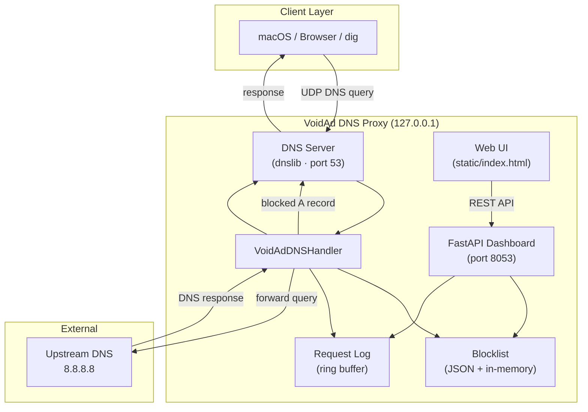
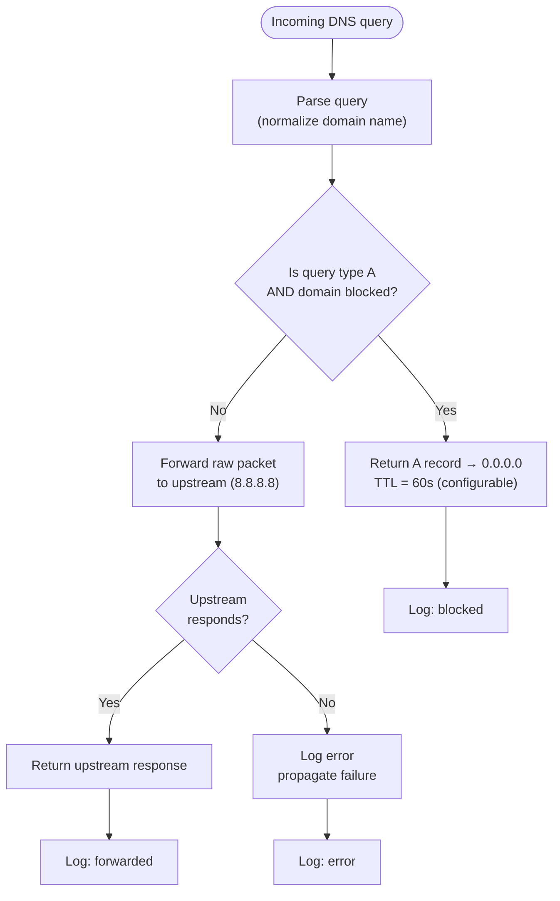

# VoidAd DNS Proxy

A lightweight, localhost-only DNS proxy for **VoidAd development and testing**. It intercepts DNS queries, blocks domains on a configurable blocklist (returning `0.0.0.0`), and forwards all other traffic to a public upstream resolver.

Built with Python, [dnslib](https://github.com/paulc/dnslib), and [FastAPI](https://fastapi.tiangolo.com/).

---

## Table of Contents

- [Features](#features)
- [Installation](#installation)
- [Usage](#usage)
- [Architecture](#architecture)
- [How Filtering Works](#how-filtering-works)
- [Configuration](#configuration)
- [API Reference](#api-reference)
- [Security Considerations](#security-considerations)
- [Project Structure](#project-structure)

---

## Features

| Capability | Description |
|------------|-------------|
| **Dual-layer protection** | DNS (network) + browser extension (UI cleaner) — see [docs/dual-layer.md](../../docs/dual-layer.md) |
| DNS interception | Listens on `127.0.0.1:53` via `dnslib` |
| Blocklist filtering | Returns `0.0.0.0` / `::` for blocked domains (A + AAAA) |
| Black hole list | **OISD Big** (~450k ad/tracker domains), auto-downloaded on start |
| Suffix matching | Blocking `doubleclick.net` also blocks `ads.doubleclick.net` |
| Upstream forwarding | Non-blocked queries forwarded to `8.8.8.8` (configurable) |
| Web dashboard | Manage blocklist and view live logs at `http://127.0.0.1:8053` |
| Persistent storage | Blocklist saved to `data/blocklist.json` |

---

## Installation

### Prerequisites

- **Python 3.10+**
- **macOS** (primary target; works on Linux with equivalent DNS setup)
- **Port 53 access** — requires `sudo` on macOS for the default DNS port

### Step 1 — Clone and enter the project

From the VoidAd repository root:

```bash
cd dev/dns-proxy
```

### Step 2 — Create a virtual environment

```bash
python3 -m venv .venv
source .venv/bin/activate
```

### Step 3 — Install dependencies

```bash
pip install -r requirements.txt
```

### Step 4 — Start the server

**Option A — Helper script (recommended)**

```bash
chmod +x run.sh
./run.sh
```

The script creates the venv if needed, installs dependencies, and re-launches with `sudo` when port 53 requires elevated privileges.

**Option B — Manual start**

```bash
sudo .venv/bin/python main.py
```

### Step 5 — Open the dashboard

Navigate to [http://127.0.0.1:8053](http://127.0.0.1:8053).

### Step 6 — Point macOS DNS to the proxy (optional)

To filter system-wide traffic:

1. **System Settings** → **Network**
2. Select your active connection (Wi‑Fi or Ethernet) → **Details…**
3. Open **DNS** → click **+** → add `127.0.0.1`
4. Drag `127.0.0.1` to the top of the list
5. Click **OK**, then **Apply**

> **Start the proxy before changing DNS.** If the server is not running, macOS will have no resolver and you will lose connectivity until you revert the DNS setting.

**Revert when done:** remove `127.0.0.1` from the DNS list or restore automatic DNS.

---

## Usage

### Verify filtering

```bash
# Blocked domain → 0.0.0.0
dig @127.0.0.1 doubleclick.net +short

# Allowed domain → real IP from upstream
dig @127.0.0.1 google.com +short
```

When macOS DNS is configured, omit the `@127.0.0.1` flag:

```bash
dig doubleclick.net +short   # 0.0.0.0
dig google.com +short          # real IP
```

### Run on a non-privileged port (no sudo)

```bash
VOIDAD_DNS_PORT=5353 python main.py
dig @127.0.0.1 -p 5353 doubleclick.net +short
```

---

## Blocklist (automated)

On startup, `main.py` calls `ensure_blocklist()` which:

1. Uses cached `data/blocklist.txt` if younger than 24 hours
2. Otherwise downloads a curated public list (default: **OISD Big**, ~450k domains)
3. Parses hosts / Adblock Plus formats into a flat domain set
4. Loads into memory as a Python `frozenset` for O(1) suffix lookups

### Supported sources (`VOIDAD_BLOCKLIST_SOURCE`)

| Value | URL | Size |
|-------|-----|------|
| `oisd-big` (default) | https://big.oisd.nl/ | ~450k |
| `oisd-small` | https://small.oisd.nl/ | ~60k |
| `stevenblack` | StevenBlack/hosts on GitHub | ~80k |

### Subdomain matching

Blocking `doubleclick.net` also blocks `ad.doubleclick.net` — no separate entry needed.
Each query walks parent suffixes with O(1) set membership per label.

### Maintaining the list

```bash
# Manual refresh (force download)
python scripts/fetch_blocklist.py --force

# Or via API while server is running
curl -X POST http://127.0.0.1:8053/api/blocklist/fetch

# Reload from disk without re-downloading
curl -X POST http://127.0.0.1:8053/api/blocklist/reload
```

The server also auto-refreshes every 24 hours in a background thread (DNS stays responsive).

### Pattern-based filtering (proactive)

VoidAd uses a **two-layer** filter (`voidad_dns/filter_engine.py`):

| Layer | Type | Example |
|-------|------|---------|
| 1. Static blocklist | Recursive suffix | `ad-provider.net` → blocks `*.ad-provider.net` |
| 2. Label patterns | **Proactive** | `cdn.adserver.evil.net` blocked even if not in OISD |

Patterns are checked **per DNS label** (`ad`, `track`, `adserver`, `telemetry`, …) so `admin.example.com` is not blocked.

Learned pattern blocks are logged to `data/learned-blocks.jsonl` for review:

```bash
curl http://127.0.0.1:8053/api/learned
curl -X POST http://127.0.0.1:8053/api/learned/evil-adserver.net/promote
```

| Variable | Default | Description |
|----------|---------|-------------|
| `VOIDAD_PATTERN_BLOCKING` | `true` | Enable label heuristics |
| `VOIDAD_LEARNED_BLOCKS` | `true` | Log pattern blocks for review |

### Environment variables

| Variable | Default | Description |
|----------|---------|-------------|
| `VOIDAD_BLOCKLIST_AUTO_FETCH` | `true` | Download on startup / schedule |
| `VOIDAD_BLOCKLIST_SOURCE` | `oisd-big` | List source |
| `VOIDAD_BLOCKLIST_REFRESH_HOURS` | `24` | Re-download interval |
| `VOIDAD_BLOCKLIST_PATH` | `data/blocklist.json` | Local path (`.txt` preferred) |

---

## Architecture

The proxy runs two concurrent services in a single process: a DNS server (background thread) and a FastAPI web dashboard (main thread). Both share the same in-memory blocklist and request log.



### Component overview

| Component | Module | Role |
|-----------|--------|------|
| Entry point | `main.py` | Starts FastAPI + DNS server |
| DNS server | `voidad_dns/dns_server.py` | Wraps `dnslib` UDP listener |
| Query handler | `voidad_dns/dns_handler.py` | Block-or-forward decision logic |
| Blocklist | `voidad_dns/blocklist.py` | Thread-safe set with JSON persistence |
| Upstream resolver | `voidad_dns/resolver.py` | Forwards raw DNS packets via UDP |
| Request log | `voidad_dns/request_log.py` | In-memory ring buffer of query events |
| Dashboard API | `voidad_dns/api.py` | REST endpoints + lifecycle hooks |
| Web UI | `voidad_dns/static/index.html` | Blocklist management and live log view |

---

## How Filtering Works

Every incoming DNS query follows this decision path:



### Blocklist matching

1. **Normalization** — domain names are lowercased and trailing dots are stripped (`Ads.Example.COM.` → `ads.example.com`).
2. **Exact match** — `doubleclick.net` in the blocklist blocks `doubleclick.net`.
3. **Suffix match** — `doubleclick.net` also blocks any subdomain such as `ads.doubleclick.net` or `www.ads.doubleclick.net`.
4. **Validation** — domains added via the API must pass a strict hostname regex before being stored.

### What gets blocked

| Query type | Blocked domain | Behavior |
|------------|----------------|----------|
| `A` | Yes | Returns `0.0.0.0` |
| `A` | No | Forwarded to upstream |
| `AAAA`, `CNAME`, etc. | Yes | Forwarded to upstream (not blocked) |
| Any | No | Forwarded to upstream |

Only **A-record** queries for blocked domains are intercepted. This mirrors common ad-blocker behavior at the DNS layer and is sufficient for testing VoidAd's domain-filter logic.

### Default blocklist

On first run, `data/blocklist.json` is seeded with common ad and tracker domains:

- `doubleclick.net`
- `googlesyndication.com`
- `googleadservices.com`
- `adservice.google.com`
- `facebook.net`
- `scorecardresearch.com`
- `analytics.google.com`
- `google-analytics.com`

---

## Configuration

All settings are controlled via environment variables:

| Variable | Default | Description |
|----------|---------|-------------|
| `VOIDAD_DNS_HOST` | `127.0.0.1` | DNS bind address |
| `VOIDAD_DNS_PORT` | `53` | DNS listen port |
| `VOIDAD_UPSTREAM_DNS` | `8.8.8.8` | Upstream resolver |
| `VOIDAD_UPSTREAM_TIMEOUT` | `2.0` | Upstream timeout (seconds) |
| `VOIDAD_API_HOST` | `127.0.0.1` | Dashboard bind address |
| `VOIDAD_API_PORT` | `8053` | Dashboard port |
| `VOIDAD_BLOCK_TTL` | `60` | TTL for blocked A records |
| `VOIDAD_LOG_MAX_ENTRIES` | `2000` | Max in-memory log entries |
| `VOIDAD_BLOCKLIST_PATH` | `data/blocklist.json` | Blocklist file path |
| `VOIDAD_SYNC_URL` | — | VoidAd `/api/dns/tenants` URL for home network sync |
| `VOIDAD_SYNC_KEY` | — | Bearer token (matches `VOIDAD_DNS_SYNC_KEY` in Next.js) |
| `VOIDAD_SYNC_INTERVAL` | `30` | Tenant poll interval (seconds) |

### Home Wi‑Fi control (multi-tenant)

When deployed as VoidAd's public DNS server:

1. User registers on **voidad.com** → gets a DNS profile
2. User sets **router DNS** to VoidAd (`dns.voidad.com`)
3. User clicks **Register this Wi‑Fi** on the dashboard
4. DNS server maps the home **public IP** → user account → blocklist & settings

Sync the DNS server with the website:

```bash
export VOIDAD_SYNC_URL=http://localhost:3000/api/dns/tenants
export VOIDAD_SYNC_KEY=your-sync-secret
sudo python main.py
```

Example:

```bash
VOIDAD_UPSTREAM_DNS=1.1.1.1 VOIDAD_BLOCK_TTL=300 sudo python main.py
```

---

## API Reference

| Method | Path | Description |
|--------|------|-------------|
| `GET` | `/` | Web dashboard |
| `GET` | `/api/health` | Health check |
| `GET` | `/api/stats` | Counters and runtime config |
| `GET` | `/api/blocklist` | List blocked domains |
| `POST` | `/api/blocklist` | Add domain — body: `{"domain": "example.com"}` |
| `DELETE` | `/api/blocklist/{domain}` | Remove domain |
| `GET` | `/api/logs?limit=100` | Recent query log (max 500) |
| `DELETE` | `/api/logs` | Clear log |

---

## Security Considerations

### Local development only

This tool is designed exclusively for **local development and testing**. It must not be deployed to production, exposed to a LAN, or used as a network-wide DNS appliance without significant hardening.

### Localhost binding

Both the DNS server and the FastAPI dashboard bind to **`127.0.0.1` only**. They are not reachable from other machines on the network. Do not change the bind address to `0.0.0.0` unless you fully understand the implications.

### No authentication

The dashboard API has **no authentication or authorization**. Anyone with access to your machine can modify the blocklist. This is acceptable for a single-developer localhost setup but would be a critical gap in any shared or remote environment.

### Privileged port

Port 53 requires root privileges on macOS. Run with `sudo` only when needed, and stop the server when you are done testing. Prefer `VOIDAD_DNS_PORT=5353` if you want to avoid elevated privileges (requires pointing clients to that port explicitly).

### Partial blocking scope

Only **A-record** queries for blocked domains are intercepted. AAAA, CNAME, and other record types for blocked domains still resolve via upstream. Applications that prefer IPv6 or use non-A lookups may bypass the block. This is intentional for the current development scope.

### Upstream trust

Non-blocked queries are forwarded in full to the configured upstream resolver (`8.8.8.8` by default). The proxy does not inspect, cache, or modify forwarded responses. Use a resolver you trust, or point to a local recursive resolver if needed.

### DNS dependency risk

Pointing macOS system DNS to `127.0.0.1` makes **all** network resolution depend on this process. If the proxy crashes or is stopped, DNS resolution fails system-wide until you revert the setting or restart the server.

### Input validation

Domains submitted through the API are validated against a strict hostname pattern before being added to the blocklist. Invalid input is rejected with a `400` response.

### Data persistence

The blocklist is stored as plain JSON on disk (`data/blocklist.json`). It contains no secrets, but be aware that blocklist changes are immediately written to disk and survive restarts.

---

## Project Structure

```
dev/dns-proxy/
├── main.py                    # Entry point
├── run.sh                     # Setup + launch helper
├── requirements.txt           # Python dependencies
├── README.md
├── data/
│   └── blocklist.json         # Persisted blocklist
└── voidad_dns/
    ├── __init__.py
    ├── config.py              # Environment-based settings
    ├── blocklist.py           # Blocklist logic + persistence
    ├── dns_handler.py         # Block-or-forward resolution
    ├── dns_server.py          # dnslib server wrapper
    ├── resolver.py            # Upstream UDP forwarding
    ├── request_log.py         # In-memory query log
    ├── api.py                 # FastAPI application
    └── static/
        └── index.html         # Dashboard UI
```

---

## License

Part of the [VoidAd](https://github.com/voidad) project. For internal development use.
